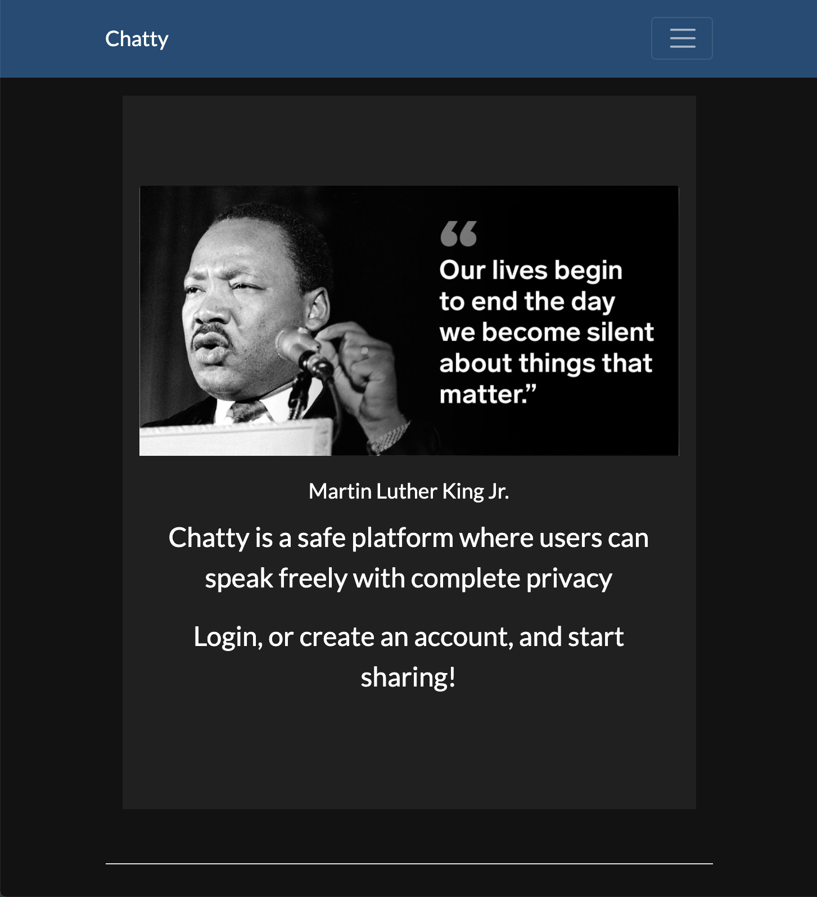

# Chatty

GOING UNDER RECONSTRUCTION

<!-- HTML, CSS, JS, MERN, Heroku

Live Link = https://calm-inlet-50295.herokuapp.com/

<h3>Summary</h3>
I built this app because I wanted to build a full stack application and test my skills. It took me a while to figure it and also googling most of the functionality but it worked out in the end. I learned a lot how the whole stack works together. I consider this my first big project and I am proud of the outcome. I know I can do better and will show it on my next application. -->

<h3>Author</h3>

Roger Alexander - Full Stack Developer <a href="http://www.douschesois.com">Portfolio Website</a>
